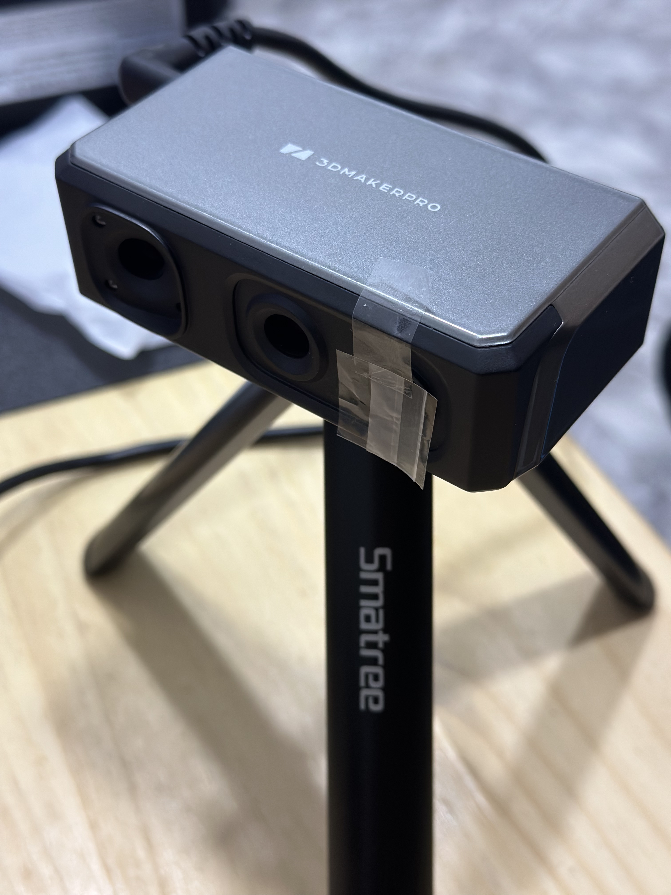
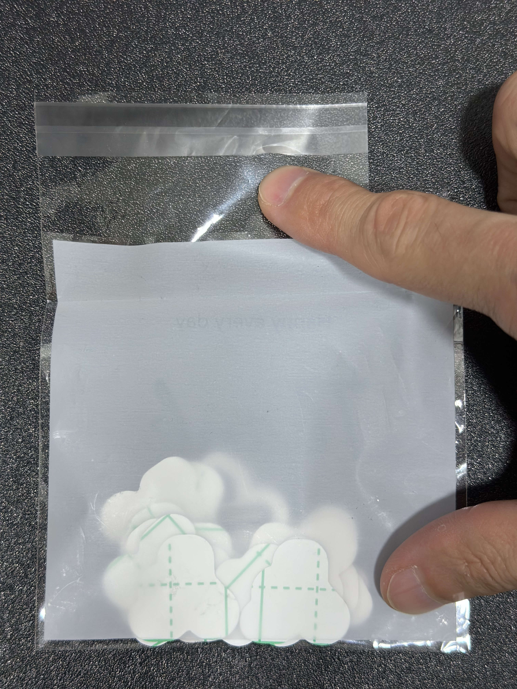
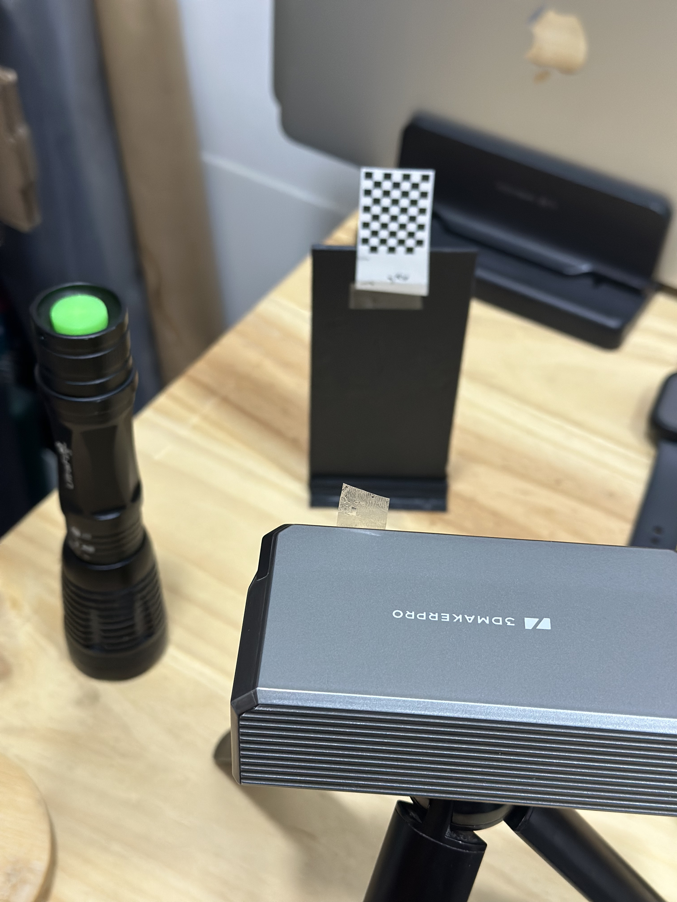
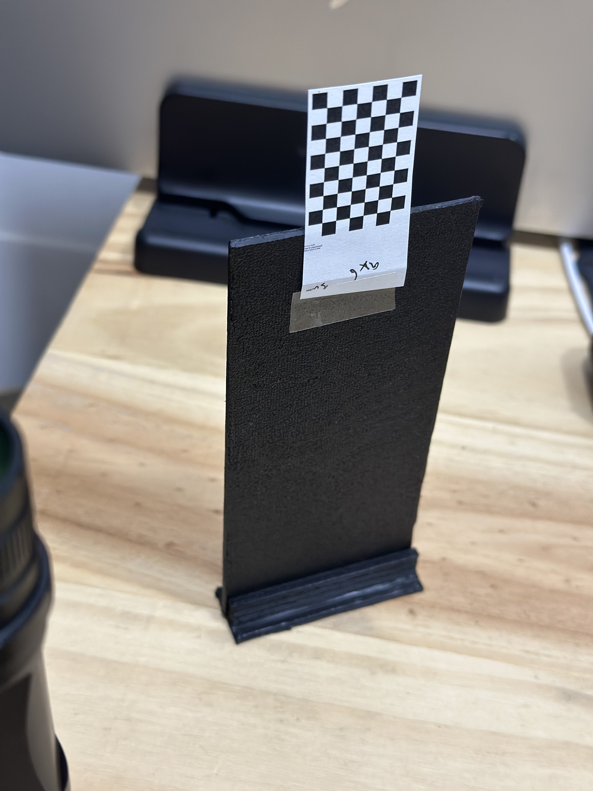

# 3DMakerpro Seal Lite Re-calibration

> Tools for **stereo camera calibration** and **3D reconstruction** with laser and UV, developed independently for the **3DMakerPro SEAL Lite** scanner.

- 🔬 **Compatibility**: tested **exclusively with 3DMakerPro SEAL Lite**.
- 🙅‍♂️ Project **not affiliated** with 3DMakerPro or distributors.

> [!WARNING]  
> This software is provided **as is**, without warranty of any kind.
> 
> - Misuse may **void the warranty** of the device.
> - The author **is not responsible** for any damage, loss, or failure resulting from use or misuse.
> 
> **Use it at your own risk and discretion.**

---

## Table of Contents
- [Context / Background](#context--background)
- [Preparation](#preparation)
- [Installation](#installation)
- [Usage](#usage)
- [Technical Description](#technical-description)
- [Camera Permissions in macOS](#camera-permissions-in-macos)
- [Quick Start](#quick-start)
- [Interactive Session](#interactive-session)
- [Calibration Template](#calibration-template)
- [Implementation Details](#implementation-details)
- [Quick Diagnosis](#quick-diagnosis)
- [Notes / Best Practices](#notes--best-practices)
- [UV Brightness/Contrast Types](#types-of-uv-brightnesscontrast-optional)
- [Detected USB Cameras](#detected-usb-cameras)
- [Camera Configuration](#camera-configuration)
- [Main Scripts](#main-scripts)
- [Features](#features)
- [Requirements](#requirements)
- [Available Options](#available-options)
- [Controls During Calibration](#controls-during-calibration)
- [Output](#output)
- [Documentation](#documentation)

---

## Context / Background

After normal and careful use of the **3DMakerPro SEAL Lite**, the scanner began to produce **horizontal lines** when attempting to capture images.  
The following attempts were made, without success:

- Software updates on **macOS** and **Windows**  
- Support from **official technical support**
- Contacting the **administrator** of the Facebook group

Frustrated by the lack of a solution (even with a warranty), I developed this **proprietary calibration tool** based on **OpenCV** to restore functionality and better understand the device.

> [!NOTE]  
> They don't really provide technical support. I don't know the rate of complaints from users who can't scan. It's been two weeks and I still don't have a solution, and the technicians aren't doing anything about it.
> I think releasing a tool that can calibrate would alleviate the situation, so I've decided to release the tool so that users can do it themselves.


### Problem:
<video src="/Content/Problem/problem_no_see_nothing.mp4" width="500"></video>

### Solution:
<video src="/Content/After calibration/scan_point_increse.mp4" width="500"></video>


---

## Preparation

To calibrate both cameras, you need to remove the pattern projection from one of the UV cameras. I did this with a "smoked film" that just allowed me to do it. You can also use a UV flashlight to be able to see in that camera.

<details>
<summary>🔧 Setup Instructions (click to expand)</summary>

### Step 1: Camera Preparation
Paste the smoked film on the left side looking from the back, or use a UV flashlight for the UV camera.

| Smoked Film Application | UV Flashlight Setup |
|:----------------------:|:-------------------:|
|  |  |

### Step 2: Calibration Pattern
For the UV flashlight, use a chessboard pattern that is in the folder `patterns/2-sets-of-patterns-in-a4.pdf`. I used the smaller pattern which is 9x6 and each square is 3mm.

| Pattern Placement | Close-up View |
|:----------------:|:-------------:|
|  |  |

### Step 3: Camera Positioning
It is recommended to use a tripod to stabilize the camera during calibration.

</details>

For calibration, check the images I have left in the `calib_imgs` folder. I follow the pattern as in the image `patterns/pattern.pdf`.

---

## Installation

```bash
uv venv
source .venv/bin/activate
pip install -r requirements.txt
```

---

## Usage

The command I used for calibration is:
```bash
python stereo_calibration.py --rows 6 --cols 9 --square-size 3 --images 15 --output stereo_calibration.txt --template calibJMS1006207.txt --dev-id JMS1006207 --no-auto-capture
```

There are more settings, so you can review the [Available Options](#available-options) section.

---

## Technical Description

Stereo calibration and 3D reconstruction tools with pattern support:

- **Chessboard**
- **Asymmetric circles**
- **ChArUco (ArUco + Chessboard)**

**Cameras (SEAL Lite):**
- Camera **A**: **Laser** (front) → **index 0**
- Camera **B**: **UV** (tilted) → **index 1**

---

## Camera Permissions in macOS

If you see:
```
OpenCV: not authorized to capture video (status 0)
```
Grant permissions to **Terminal/Python** in  
**System Preferences → Security & Privacy → Privacy → Camera**

Force the prompt:
```bash
python3 -c "import cv2; cap=cv2.VideoCapture(0); print('Cam abierta:', cap.isOpened()); cap.release()"
```

If not, in my profile there is a repository for a tool that can grant authorization to programs to access PC devices. ([Repo See here](https://github.com/klich3/sonoma-workaround-allow-services))

---

## Quick Start

### Basic calibration (dashboard)
```bash
python stereo_calibration.py --left 0 --right 1 --rows 6 --cols 9 --square-size 25.0
```

### Asymmetric circles + UV adjustment
```bash
python stereo_calibration.py --pattern-type circles --rows 11 --cols 4 --square-size 6.70 --uv-brightness 0.6 --uv-contrast 0.5
```

### ChArUco (with automatic fallback)
```bash
python stereo_calibration.py --pattern-type charuco --rows 7 --cols 5 --square-size 20.0
```

---

## Interactive Session (detection, drawing and auto-capture)

During calibration:

1. The stream is **combined**: **Left (A/Laser)** | **Right (B/UV)** in a 2560×720 window.  
2. The chosen pattern is **detected** on each side.  
3. Corners/points are **drawn** (with horizontal **offset** applied to the right image).  
4. A pair is **auto-captured** when **both** sides detect a pattern (with anti-bounce delay ≈ **1.0 s**).  
5. Temporary images are **saved** and 2D/3D points are **accumulated** for calibration.

**On-screen HUD:**
- `Pairs captured: X/N`
- `Right (B-UV) FPS | Left (A-Laser) FPS`
- `Right/Left pattern: YES/NO`
- `Type: chessboard | circles | charuco`

**Shortcuts:**
- `q` → exit
- `+ / -` → **UV** brightness
- `c / x` → **UV** contrast

---

## Calibration Template

**Generate results** and "SEAL compatible" file:
```bash
python stereo_calibration.py --left 0 --right 1 --rows 6 --cols 9 --square-size 25.0 --images 15 --output stereo_calibration.txt --template calibJMS1006207.txt --dev-id JMS1006207
```

**Attributes** that the script inserts/updates when generating the final file (based on your calibration):
- **Intrinsic** (**A/Laser** camera): `fx, fy, cx, cy`
- **Distortion** (5 coef.): `k1, k2, p1, p2, k3`
- **Forced resolution**: `1280×720`  
- **Metadata**: `CalibrateDate`, `Type: Sychev-calibration`, `SoftVersion: 3.0.0.1116`, `DevID` (if `--dev-id` is passed)

> You can also provide a **base file** (not a template) with reasonable values for SEAL Lite, so that the user can adjust it after their own calibration.

---

## Implementation Details

- **Capture and low latency**: `CameraStream` uses `CAP_PROP_BUFFERSIZE=1`, queue `maxsize=3`, real FPS calculation, and cascading backends (`CAP_ANY → CAP_AVFOUNDATION → CAP_V4L2`).  
- **Cached detection**: `PatternDetector` limits detections to 0.1s intervals to avoid CPU overload.
- **Patterns**:
  - *Chessboard*: `findChessboardCorners` + `cornerSubPix`  
  - *Asymmetric circles*: `SimpleBlobDetector` + `findCirclesGrid(ASYMMETRIC_GRID)` with direct fallback
  - *ChArUco*: `CharucoDetector` (DICT_6X6_250); during capture, attempts `matchImagePoints` for matches; if it fails, standard fallback  
- **Auto capture**: when both sides detect a pattern, save `left_XX.jpg` / `right_XX.jpg` (tmp) and accumulate `objpoints/imgpoints`.
- **Calibration**:
  - Individual A/B: `cv2.calibrateCamera`  
  - Stereo: `cv2.stereoCalibrate` (criterion `EPS|MAX_ITER`)
- **Output**:
  - **Technical** file (`--output`) with `K_right`, `dist_right`, `K_left`, `dist_left`, `R`, `T`  
  - **SEAL compatible** file via `seal_calib_writer.write_new_calibration(...)` and metadata update

---

## Quick Diagnosis

Test cameras individually:
```bash
python -c "import stereo_calibration as s; s.test_single_camera(0, 'Laser (A)', 10)"
python -c "import stereo_calibration as s; s.test_single_camera(1, 'UV (B)', 10)"
```
- Shows **backend**, **FOURCC**, **theoretical/actual FPS** and confirms OS permissions.

---

## Notes / Best Practices

- Start **A (Laser)** first, wait ~2 s, and then **B (UV)**.
- Fill most of the frame with the pattern and vary angles/distances between captures.
- For **circles**, avoid saturation and pay attention to contrast (important for the blob detector).  
- If **ChArUco** does not detect, there is a **fallback** to *chessboard* (notified by logs).  
- The working resolution is **forced to 1280×720** for consistency with the device software.

---

## Types of UV Brightness/Contrast (optional)

If your backend supports floating point values, use `float` instead of `int` in `argparse`:
```python
parser.add_argument("--uv-brightness", type=float, default=-1.0, ...)
parser.add_argument("--uv-contrast",  type=float, default=-1.0, ...)
```

---

## Detected USB Cameras

```
KYT Camera A:

  Model Number:	UVC Camera VendorID_3141 ProductID_25450
  Unique identifier:	0x145110000c45636a

KYT Camera B:

  Model Number:	UVC Camera VendorID_3141 ProductID_25451
  Unique identifier:	0x145120000c45636b
```

---

## Camera Configuration

- Laser camera (front): Index 0
- UV camera (inclined): Index 1

---

## Main Scripts

### stereo_calibration.py
Stereo calibration with two cameras:

```bash
# Basic calibration
python stereo_calibration.py

# Calibration with specific parameters
python stereo_calibration.py --left 0 --right 1 --rows 6 --cols 9 --square-size 25.0
python stereo_calibration.py --rows 6 --cols 9 --square-size 3 --images 15 --output stereo_calibration.txt --template calibJMS1006207.txt --dev-id JMS1006207 --no-auto-capture

# Use circle pattern
python stereo_calibration.py --pattern-type circles
python stereo_calibration.py --output stereo_calibration.txt --template calibJMS1006207.txt --dev-id JMS1006207 --pattern-type circles --rows 11 --cols 4

# Use ChArUco pattern
python stereo_calibration.py --pattern-type charuco
python stereo_calibration.py --left 1 --right 0 --images 15 --output stereo_calibration.txt --template calibJMS1006207.txt --dev-id JMS1006207 --pattern-type charuco  --rows 7 --cols 5 --square-size 8.57 --no-auto-capture
python stereo_calibration.py --left 1 --right 0 --images 15 --output stereo_calibration_charuco.txt --template calibJMS1006207.txt --dev-id JMS1006207 --pattern-type charuco --no-auto-capture --aruco-dict DICT_7X7_250

# Adjust UV camera brightness
python stereo_calibration.py --uv-brightness 0.5 --uv-contrast 0.5
```

### Calibration Methods

1. **Chessboard**:
   - Traditional calibration pattern
   - Robust detection in various lighting conditions
   - Requires a completely visible flat pattern

2. **Asymmetric circles**:
   - Pattern of circles arranged in an asymmetric grid
   - Less sensitive to lens distortions
   - Allows partial detection of the pattern

3. **ChArUco (charuco)**:
   - Combination of ArUco markers and chessboard
   - Greater precision in corner detection
   - Allows detection with partial occlusions

---

## Features

- Simultaneous stereo calibration of two cameras
- Pattern detection: chessboard, asymmetric circles, and ChArUco
- Automatic or manual image capture
- Support for different ArUco dictionaries
- Brightness and contrast settings for the UV camera
- FPS control

---

## Requirements

- Python 3.7+
- OpenCV 4.5+
- NumPy

---

## Installation

```bash
pip install -r requirement.txt
```

---

## Available Options

```
--left INDEX          Left camera index (A - laser, default 0)
--right INDEX         Right camera index (B - UV, default 1)
--rows ROWS           Board rows (default 6)
--cols COLUMNS        Board columns (default 9)
--square-size SIZE    Square size in mm (default 25.0)
--images NUMBER       Number of pairs to capture (default 15)
--pattern-type TYPE   Pattern type: chessboard, circles, charuco
--no-auto-capture     Disable automatic capture and use space bar
--fps FPS             Target FPS for cameras
--aruco-dict DICTIONARY  ArUco dictionary for ChArUco (use 'auto' for automatic detection)
--uv-brightness VALUE Brightness for UV camera
--uv-contrast VALUE   Contrast for UV camera
```

---

## Controls During Calibration

- **Space bar**: Capture image (in manual mode)
- **q**: Exit
- **+**: Increase brightness of UV camera
- **-**: Decrease brightness of UV camera
- **c**: Increase contrast of UV camera
- **x**: Decrease contrast of UV camera

---

## Output

The program generates two calibration files:
- `stereo_calibration.txt`: Technical calibration results
- `stereo_calibration_seal.txt`: SEAL-compatible calibration file

---

## Notes

- Make sure you have camera access permissions on your system
- For macOS, grant camera permissions to Terminal/Python in System Preferences

---

## Documentation

* https://developer.mamezou-tech.com/en/robotics/vision/calibration-pattern/
* https://github.com/chandravaran/Stereo_camera_3D_map_generation